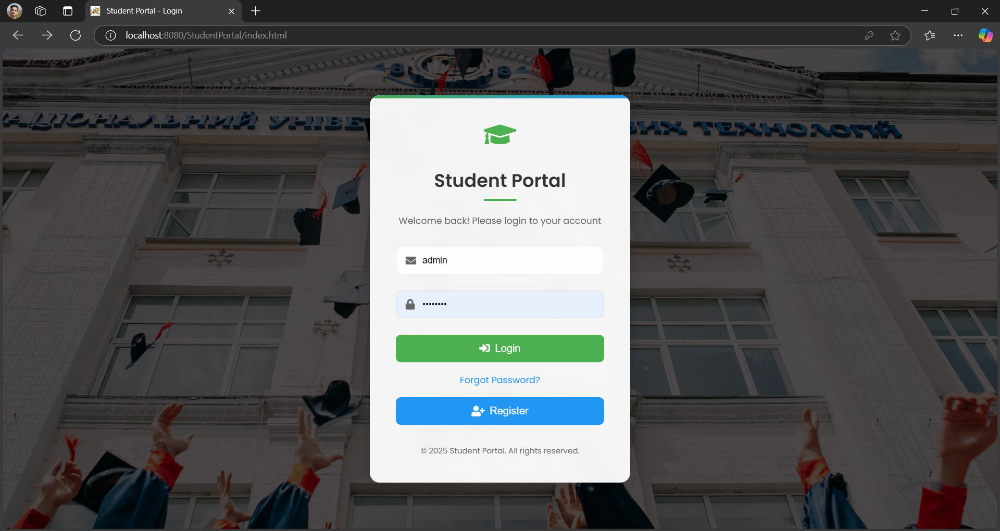
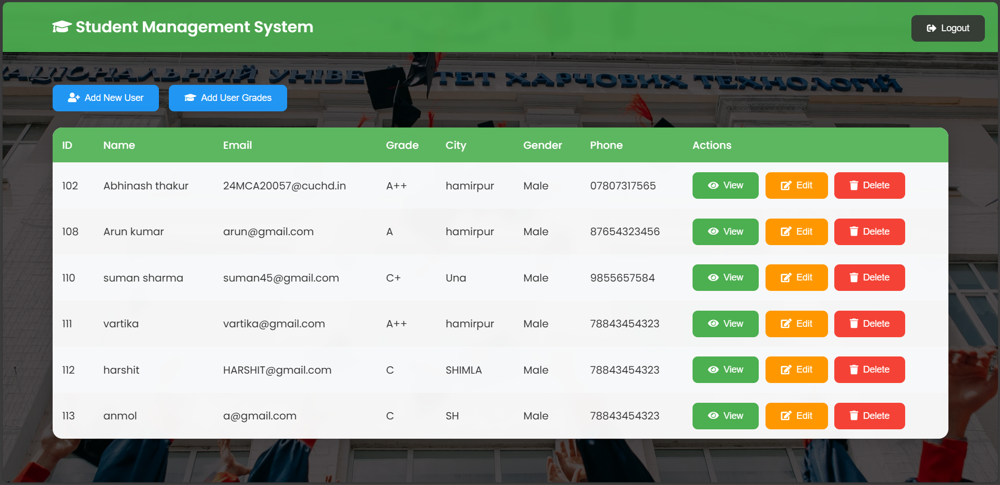
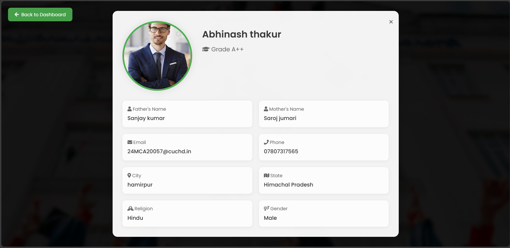
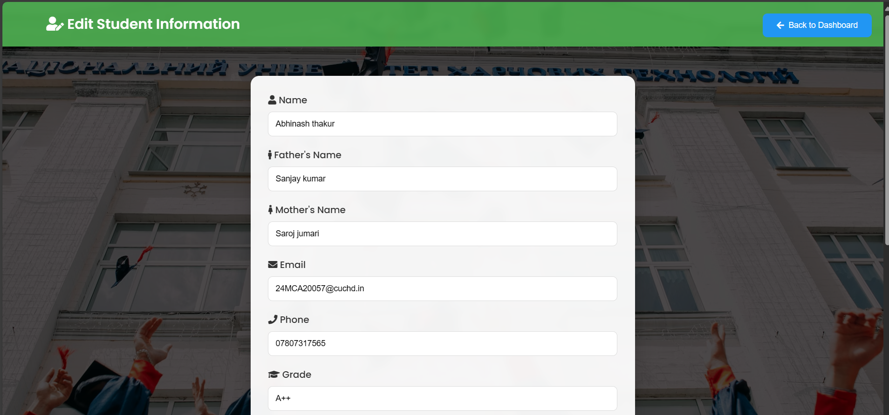
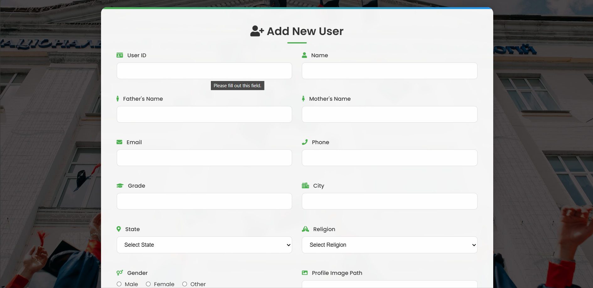
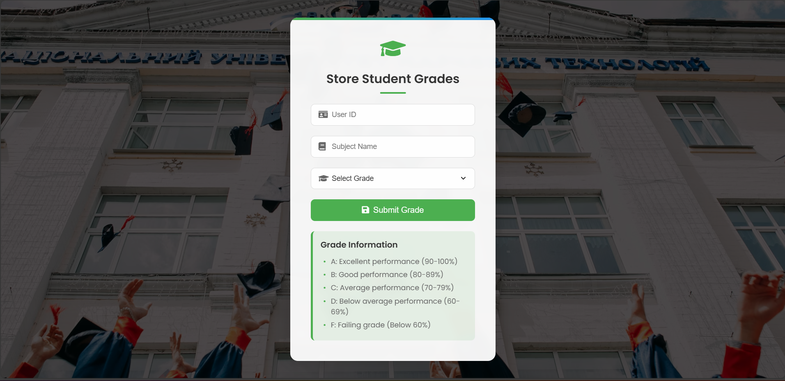
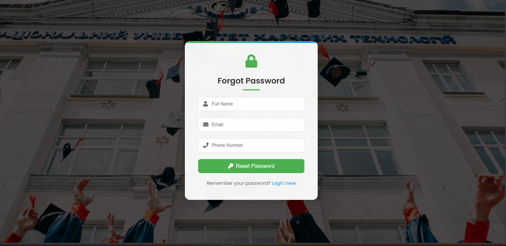

#Student Management System
# 🚀 Advanced Internet Programming Project

Welcome to the **AIP Web Application** — a dynamic and interactive web app built using the powerful trio of **JavaBeans**, **Servlets**, and **JSP**, all running on the sturdy backbone of the **Apache Tomcat Server**. It’s connected seamlessly with a **MySQL** database managed via **phpMyAdmin**.

Whether you're a student, an enthusiast, or a curious techie, this project demonstrates the real-world application of core Java EE concepts. Let's dive into the tech and get this running on your machine!

---

## 🔧 Tech Stack at a Glance

| Layer       | Technology      |
|-------------|-----------------|
| Frontend    | HTML5, CSS3, JSP |
| Backend     | Java Servlets, JavaBeans |
| Server      | Apache Tomcat 9+ |
| Database    | MySQL via phpMyAdmin |
| Connector   | JDBC (Java Database Connectivity) |

---

## ✨ Key Features

- 🔐 **User Authentication** – Sign up & login functionality using JavaBeans and Servlets.
- 📄 **Form Handling** – Efficient server-side processing.
- 📊 **Database Integration** – Full CRUD operations with MySQL.
- 🧠 **MVC Architecture** – Clear separation of concerns.
- 🎨 **Dynamic UI** – Powered by JSP with a smooth user experience.

---

## 🛠️ Step-by-Step Setup Guide

Follow these steps to get the application running on your local machine:

### 📁 1. Clone the Repository

```bash
git clone https://github.com/your-username/aip-webapp.git
cd aip-webapp
```

### 🧑‍💻 2. Import the Project into Your IDE
Open Eclipse / IntelliJ IDEA / NetBeans.

Select Import > Existing Project > Java Web.

Ensure Apache Tomcat is properly configured in your IDE.

### 🏗️ 3. Setup the MySQL Database
Launch phpMyAdmin (usually at http://localhost/phpmyadmin).

Create a new database named:

```nginx
aip_project_db
```
Import the SQL file:

Navigate to the "Import" tab in phpMyAdmin.

Select the provided aip_project_db.sql file from the database/ folder.

Click Go.

### 🔌 4. Configure Database Connection in Code
Open the DBConnection.java file (typically in a utils or dao package), and update:

```java
String url = "jdbc:mysql://localhost:3306/aip_project_db";
String username = "root";
String password = ""; // your MySQL/phpMyAdmin password here
```
### 🚀 5. Deploy the Web App on Tomcat
Right-click the project → Run on Server → Choose Tomcat.

Or manually deploy the .war file to webapps/ in Tomcat.

Then visit in browser:

```bash
http://localhost:8080/aip-webapp/
```
Welcome to your AIP project dashboard! 🎉

### 🗂️ Project Folder Structure

## 📦 aip-webapp/
```css
📦 StudentManagementSystem/
├── 🛠️ build/                            # Compiled classes
├── 📦 dist/
│   └── 📦 StudentPortal.war             # WAR file for deployment
├── ⚙️ nbproject/                        # NetBeans configuration files
├── 📁 src/
│   ├── 🧾 conf/
│   │   └── 📄 MANIFEST.MF              # Manifest file
│   ├── 🧠 java/
│   │   ├── 🧩 AddUserServlet.java
│   │   ├── 🔌 DBConnection.java
│   │   ├── 📊 DashboardServlet.java
│   │   ├── ✏️ EditUserServlet.java
│   │   ├── 📝 RegisterServlet.java
│   │   ├── 🔐 ResetPasswordServlet.java
│   │   ├── 📄 Student_Test_Grades.java
│   │   ├── ❓ forgot.java
│   │   ├── 🔑 login.java
│   │   ├── 🚪 logout.java
│   │   └── 👤 userProfile.java
│   ├── 📁 main/
│   │   └── 📁 java/                     # Optional application logic
│   └── 🧪 test/                         # Test packages (if any)
├── 🌐 web/
│   ├── 📁 META-INF/
│   ├── 📁 WEB-INF/
│   │   └── 📄 web.xml                  # Deployment descriptor
│   ├── 📄 Student_Test_Grades.html
│   ├── ❓ forgot.html
│   ├── 🏠 index.html
│   ├── 📝 registration.html
│   └── 🔁 reset_password.html
└── 🧱 build.xml                         # Ant build script
```
## Screenshots
<div style="display: flex; flex-wrap: wrap; justify-content: center; gap: 10px;">

  
  
  

  
  

  
  
</div>

### 🙋‍♂️ Author
#### 👨‍💻 Abhinash
#### 📧 abhit7575@gmail.com
## 🎓 Project submitted for Advanced Internet Programming course.


